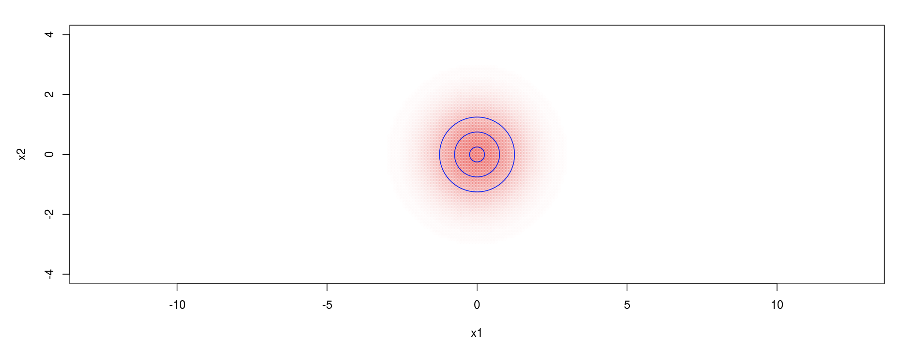

# Байесовский классификатор
Байесовский классификатор — класс алгоритмов классификации, основанных на принципе максимума апостериорной вероятности. Все эти алгоритмы построены на формуле байеса приведенной ниже
## Формула Байеса
</a>
1. </a> - Апостериорная вероятности, т.е. вероятность того, что объект x принадлежит классу y.
2. </a> - функция правдободобия.
3. </a> - Априорная вероятность, т.е. вероятность появления класса.

</a>

## Линии уровня нормального распределения

<a href="http://khurshudoff.shinyapps.io/2d_lines">Визуализация линий уровня нормального распределния</a>
