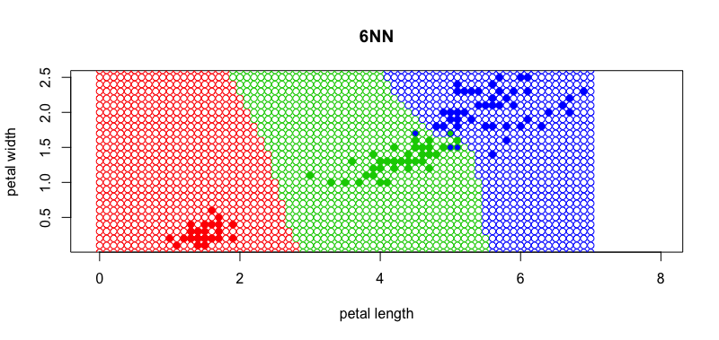
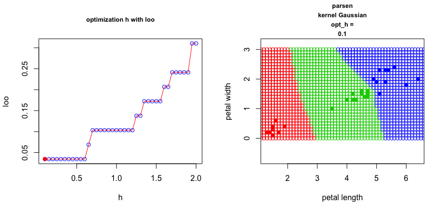
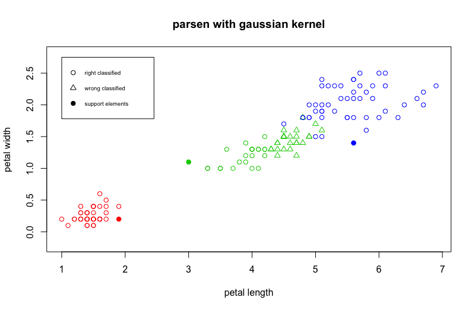
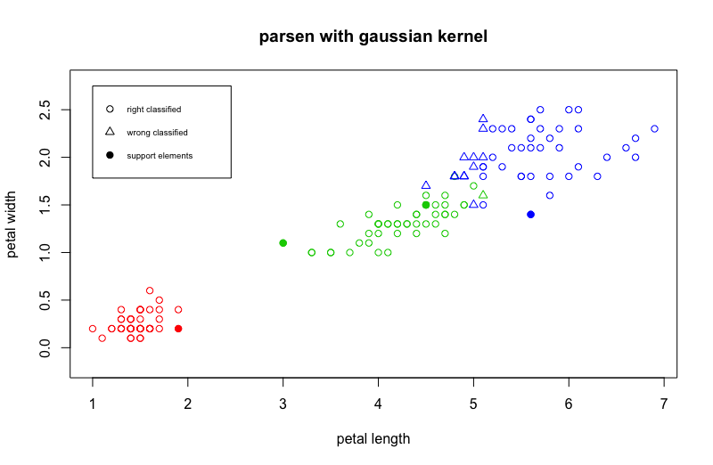

<h1>Метрические классификаторы</h1>

<h2>Постановка задачи:</h2>
<h3>Дано:</h3>
<ul>
	<li>X - объекты</li>
	<li>Y - ответы</li>
	<li><a href="https://www.codecogs.com/eqnedit.php?latex=X^l&space;=&space;(x_i,y_i)_{i=1}^{l}" target="_blank"></a> - обучающая выборка</li>
</ul>

<h3>Найти:</h3>
<ul>
	<li>Класс нового объекта х</li>
</ul>

<h2> Рассмотренные алгоритмы: </h2>
<table>
  <tbody>
        <tr>
	         <td>Метод</td>
		 <td>Параметры</td>
	         <td>Точность</td>
	</tr>
	<tr>
		<td><a href="#parsenGaus">Метод Парзеновского окна с Гауссовким ядром</a></td>
		<td>h=0.1</td>
		<td>0,97</td>
	</tr>
	<tr>
		<td><a href="#kNN">Метод К ближайших соседей</a></td>
		<td>К=6</td>
		<td>0,97</td>
	</tr>
	<tr>
		<td><a href="#kWNN">Метод К взвешенных ближайших соседей</a></td>
		<td>k=30, q=0.95</td>
		<td>0,97</td>
	</tr>
	<tr>
		<td><a href="#parsenEpan">Метод Парзеновского окна с ядром Епанечнкова</a></td>
		<td>h=0.6</td>
		<td>0,96</td>
	</tr>
	<tr>
		<td><a href="#parsenQuart">Метод Парзеновского окна с квартическим ядром</a></td>
		<td>h=0.6</td>
		<td>0,96</td>
	</tr>
	<tr>
		<td><a href="#parsenTrian">Метод Парзеновского окна с треугольным ядром</a></td>
		<td>h=0.6</td>
		<td>0,96</td>
	</tr>
	  <tr>
                 <td><a href="#oneNN">Метод ближайшего соседа</a></td>
		 <td>-</td>
	         <td>0,95</td>
        </tr>
	<tr>
		<td><a href="#parsenRect">Метод Парзеновского окна с прямоугольным ядром</a></td>
	        <td>h=0.6</td>
		<td>0,95</td>
	</tr>
	<tr>
		<td><a href="#STOLP">STOLP</a></td>
	        <td>-</td>
		<td>0,97</td>
	</tr>
  </tbody>
</table>

<h2>Гипотеза компактности</h2>
<p>близкие объекты, как правило, лежат в одном классе</p>

<h2>Обобщенный метрический алгоритм классификации</h2>
Для произвольного <a href="https://www.codecogs.com/eqnedit.php?latex=x\in&space;X" target="_blank"></a> отранжируем объекты <a href="https://www.codecogs.com/eqnedit.php?latex=x_1,x_2,...x_l" target="_blank"></a>: 

<br> <div align="center"><a href="https://www.codecogs.com/eqnedit.php?latex=$$\rho&space;(&space;x,x^{(1)}&space;)\leq&space;\rho&space;(&space;x,x^{(2)}&space;)\leq&space;...&space;\leq&space;\rho&space;(&space;x,x^{(l)}&space;)$$" target="_blank"></a>,</div>

<ul>где:
	<li><a href="https://www.codecogs.com/eqnedit.php?latex=\rho&space;(x,x_i)&space;=&space;\sqrt{\sum_{j=1}^{n}&space;\left&space;|&space;x^j&space;-&space;x_i^j&space;\right&space;|^2}" target="_blank"></a></li>
	<li><a href="https://www.codecogs.com/eqnedit.php?latex=x^{(i)}" target="_blank"></a> - i-й сосед объекта х на <a href="https://www.codecogs.com/eqnedit.php?latex=x_1,&space;x_2,&space;...&space;,&space;x_l" target="_blank"></a></li>
	<li><a href="https://www.codecogs.com/eqnedit.php?latex=y^{(i)}" target="_blank"></a> - ответ на i-м соседе объекта х.</li>
</ul>

<h3>Метрический алгоритм классификации:</h3>
<div align="center"><a href="https://www.codecogs.com/eqnedit.php?latex={\color{Red}&space;a(x;X^l)&space;=&space;arg\max_{y\in&space;Y}{\sum_{i=1}^{l}{\left&space;[&space;y^{(i)}&space;=&space;y&space;\right&space;]&space;w(i,x))&space;}&space;}&space;}" target="_blank"></a>, </div>

<ul>
	<li><a href="https://www.codecogs.com/eqnedit.php?latex=\Gamma&space;_y&space;(x)&space;=&space;{\sum_{i=1}^{l}{\left&space;[&space;y^{(i)}&space;=&space;y&space;\right&space;]&space;w(i,x))&space;}&space;}" target="_blank"></a> - оценка близости объекта x к классу y.</li>
	<li><a href="https://www.codecogs.com/eqnedit.php?latex={\color{Red}&space;w(i,x)}" target="_blank"></a> - вес (степень важности) i-го соседа объекта x, неотрицателен и не возрастает по i.</li>
</ul>

<a name="oneNN"></a>
<h2>1NN</h2>

<a href="https://www.codecogs.com/eqnedit.php?latex=w(i,x)&space;=&space;[i\leq&space;1]" target="_blank"></a> - метод 1NN


<h3>Плюсы:</h3>
<ul>
	<li>Простота реализации</li>
	<li>O(1) - время обучения</li>
</ul>

<h3>Минусы:</h3>
<ul>
	<li>Неустойчивость</li>
	<li>Требуется хранить всю выборку</li>
	<li>требуется много времени на вычисление класса нового объекта</li>
</ul>

<a name="kNN"></a>
<h2>KNN</h2>

<a href="https://www.codecogs.com/eqnedit.php?latex=$$w(i,x)&space;=&space;[i&space;\leq&space;k]$$" target="_blank"></a> - метод KNN


<h3>Плюсы:</h3>
<ul>
	<li>Простота реализации</li>
	<li>O(1) - время обучения</li>
	<li>Устойчивость к выбросам</li>
</ul>

<h3>Минусы:</h3>
<ul>
	<li>Требуется хранить всю выборку</li>
	<li>требуется много времени на вычисление класса нового объекта</li>
</ul>

<h2>Выбор параметра k с помощью LOO</h2>

<a href="https://www.codecogs.com/eqnedit.php?latex=LOO(k,&space;X^l&space;)=&space;\sum_{i=1}^{l}&space;\left&space;[&space;a(x_i;&space;X^l\setminus&space;\lbrace&space;x_i&space;\rbrace&space;,&space;k)&space;\neq&space;y_i&space;\right&space;]&space;\rightarrow&space;\min_k&space;." target="_blank"></a>

<!-- knn loo optimized code -->
<code>

	looFuncOpt <- function(opt_param_min, opt_param_max, opt_param_step, data, class_func){

	  count_missclassif = c(rep(0, length( seq(opt_param_min, opt_param_max, opt_param_step))))

	  for(i in c(1:length(data[,1]) ) ){
	    xl <- data[-i,] # train data
	    z <- data[i,1:2] # object to classify
	    
	    orderedXl <- sortObjectsByDist(xl, z) # data sorted by distance to z
	    
	    n <- dim(orderedXl)[2] - 1 
	    
	    index = 1;
	    
	    for (opt_param in seq(opt_param_min, opt_param_max, opt_param_step)){
	      classes <- orderedXl[1:opt_param, n+1]
	      count <- table(classes)
	      class <- names(which.max(count))
	      if(class != data[i,3]){
	        count_missclassif[index] = count_missclassif[index] + 1
	      }
	      index = index + 1
	    }  
	  }  
	  
	  return(count_missclassif / 30)
	}
</code>




<a name="kWNN"></a>
<h2>kWNN</h2>

<a href="https://www.codecogs.com/eqnedit.php?latex=$w(i,x)&space;=&space;[i&space;\leq&space;k]w_i$" target="_blank"></a> - метод k weight NN

<!-- code of kwnn with loo -->
<code>
	
	looFuncOptKwnn <- function(k_min, k_max, k_step, q_min, q_max, q_step, data, class_func){
  
	  seq_k = seq(k_min, k_max, k_step)
	  seq_q = seq(q_min, q_max, q_step)
	  
	  count_missclassif = matrix( rep( 0, len=length(seq_k)*length(seq_q)), nrow = length(seq_k))

	  # print(length(seq_k)*length(seq_q))
	  
	  for(i in c(1:length(data[,1]) ) ){
	    xl <- data[-i,] # train data
	    z <- data[i,1:2] # object to classify
	    
	    orderedXl <- sortObjectsByDist(xl, z) # data sorted by distance to z
	    
	    n <- dim(orderedXl)[2] - 1 
	    
	    index_k = 1;
	    
	    for (k in seq_k){
	        index_q = 1
	        
	        classes <- orderedXl[1:k, n+1]
	        for(q in seq_q){
	            d <- c(0.0,0.0,0.0)
	            names(d) <- c("setosa", "versicolor", "virginica")
	            
	            for (j in c(1:length(classes))){
	              d[classes[j]] <- d[classes[j]] + weight(j, q)
	            }
	            
	            class <- names(which.max(d))
	            
	            if(class != data[i,3]){
	              count_missclassif[index_k, index_q] = count_missclassif[index_k, index_q] + 1
	            }
	            index_q = index_q + 1
	        }  
	      index_k = index_k + 1
	    }  
	  }
	  return(count_missclassif / 30)
	}
</code>

<a href="https://www.codecogs.com/eqnedit.php?latex=$w_i&space;=&space;q^i$" target="_blank"></a>

<h3> Плюсы </h3>
<ul>
	<li>Учитывается степень близости объекта</li>
</ul>


<h3>Проверка качества</h3>
Для проверки качества полученного алгоритма я решил использовать метрику accuracy. Она показывают долю правильно классифицированных объектов. Тестовую выборку я сгенерировал случайным образом из наборов ирисов Фишера.

<h4>1NN: accuracy = 0.95</h4>
<h4>kNN(k=6): accuracy = 0.97</h4>
<h4>kWNN(k=30, q=0.95): accuracy = 0.97</h4>

Из этого можно сделать вывод, что на этих данных лучше выбирать метод kNN(k=6), т.к. он проще и дает максимальную точность.

<h2>kWNN на модельных данных</h2>

На рисунке ниже наглядно показано приемущество метода k взвешенных соседей.


<h2>Сравнение качества алгоритмов</h2>
<table>
  <tbody>
    <tr>
      <td></td>
      <td>1NN</td>
      <td>kNN</td>
      <td>kWNN</td>
    </tr>
    <tr>
      <td>Число неверное классифицируемых объектов</td>
      <td>7</td>
      <td>5</td>
      <td>5</td>
    </tr>
  </tbody>
</table>

<h2>Сравнение карт классификации</h2>
<h4>1NN</h4>

<h4>kNN(k=6)</h4>

<h4>kWNN(k=30, q=0.95)</h4>


<h2>Вывод</h2>
<p>На основании полученных результатов можно сделать вывод, что на этих данных лучше выбирать метод kNN(k=6), т.к. он проще и дает максимальную точность.</p>


<h2>Parsen window</h2>
<a href="https://www.codecogs.com/eqnedit.php?latex=w(i,x)&space;=&space;K&space;\left&space;(&space;\frac{\rho&space;(x,x^{(i)})}{h}&space;\right&space;)" target="_blank"></a> , где h - ширина окна, <br>
K(r) - ядро, не возрастает и положительно на [0,1].

Метод парзеновского окна фиксированной ширины:
<br>
<a href="https://www.codecogs.com/eqnedit.php?latex=a(x;X^l,h,K)&space;=&space;\arg&space;\max_{y\in&space;Y}&space;{\sum_{i=1}^l{[y_i=y]&space;K\left(&space;\frac{\rho&space;(x,x_i)}{h}&space;\right)}}" target="_blank"></a>

<a name="parsenRect"></a>
<h3>Прямоугольное ядро</h3>
<a href="https://www.codecogs.com/eqnedit.php?latex=K(r)&space;=&space;\frac{1}{2}[\left&space;|&space;r&space;\right&space;|&space;\leq&space;1]" target="_blank"></a>

<!-- Rect kernel code -->
<code>
	
	kernelRectangle <- function(x, y, metricFunction, h){
	  r = metricFunction(x,y) / h
	  if(r <= 1){
	    return(1/2)
	  } 
	  return(0)
	}
</code>

<h4>opt_h = 0.6 <br> loo(opt_h) = 0.03333333</h4>
<h4>Точность: 0.9666667</h4>


<a name="parsenGaus"></a>
<h3>Гауссовское ядро</h3>
<a href="https://www.codecogs.com/eqnedit.php?latex=K(r)&space;=&space;(2\pi)^{\frac{1}{2}}e^{(-\frac{1}{2}&space;r^2)}" target="_blank"></a>
<!-- gaussian kernel code -->
<code>
	
	kernelGaussian <- function(x, y, metricFunction, h){
	  r = metricFunction(x,y) / h
	  return(((2*pi)^(-1/2)) * exp(-1/2*r^2))
	}
</code>

<h4>opt_h = 0.1 <br> loo(opt_h) = 0.03333333</h4>
<h4>Точность: 0.9666667</h4>


<a name="parsenEpan"></a>
<h3>Ядро Епанечникова</h3>
<a href="https://www.codecogs.com/eqnedit.php?latex=K(r)&space;=&space;\frac{3}{4}(1-r^2)[\left&space;|&space;r&space;\right&space;|&space;\leq&space;1]" target="_blank"></a>
<!-- epan kernel code -->
<code>
	
	kernelEpanechnikov <- function(x, y, metricFunction, h){
	  r = metricFunction(x,y) / h
	  if(r<=1){
	    return(3/4*(1-r^2))
	  }
	  return(0)
	  
	}
</code>

<h4>opt_h = 0.6 <br> loo(opt_h) = 0.03333333</h4>
<h4>Точность: 1</h4>


<a name="parsenQuart"></a>
<h3>Квартическое ядро</h3>
<a href="https://www.codecogs.com/eqnedit.php?latex=K(r)&space;=&space;\frac{15}{16}(1-r^2)^2[\left&space;|&space;r&space;\right&space;|&space;\leq&space;1]" target="_blank"></a>
<!-- quart kernel code -->
<code>
	
	kernelQuart <- function(x, y, metricFunction, h){
	  r = metricFunction(x,y) / h
	  if(r<=1){
	    return(15/15*(1-r^2)^2)
	  }
	  return(0)
	  
	}
</code>
<h4>opt_h = 0.6 <br> loo(opt_h) = 0.03333333</h4>
<h4>Точность: 1</h4>


<a name="parsenTrian"></a>
<h3>Треугольное ядро</h3>
<a href="https://www.codecogs.com/eqnedit.php?latex=K(r)&space;=&space;(1-\left&space;|&space;r&space;\right&space;|)[\left&space;|&space;r&space;\right&space;|&space;\leq&space;1]" target="_blank"></a>
<!-- triangle kernel code -->
<code>
	
	kernelTriangle <- function(x, y, metricFunction, h){
	  r = metricFunction(x,y) / h
	  if(r<=1){
	    return(1-abs(r))
	  }
	  return(0)
	}
</code>
<h4>opt_h = 0.6 <br> loo(opt_h) = 0.03333333</h4>
<h4>Точность: 1</h4>


<h2>Сравнение качества ядер</h2>
<table>
  <tbody>
    <tr>
      <td></td>
      <td>Прямоугольное</td>
      <td>Гауссовское</td>
      <td>Епанечникова</td>
      <td>Квартическое</td>
      <td>Треугольное</td>
    </tr>
    <tr>
      <td>Число неверное классифицируемых объектов</td>
      <td>7</td>
      <td>4</td>
      <td>6</td>
      <td>6</td>
      <td>6</td>
    </tr>
  </tbody>
</table>


<h2>Сравнение карт классификации</h2>


<h2>Вывод</h2>
<p>На основании полученных результатов можно сделать вывод, что на этих данных лучше выбирать метод парзеновского окна с гауссовским ядром, т.к. он дает маскимальную точность.</p>

<a name="STOLP"></a>
# STOLP

## Основные определения
**Отступ** - степень погруженности объекта в свой класс. Отступ будем обозначать: 
<div style="text-align: center">  </div>

Отступ вычисляется как: 
<div style="text-align: center"> , где: </div>

1.  - объект
2.  - обучающая выборка
3. 
4.  - вес i-го соседа объекта х

## Построение графика для объектов обучения относительно Парзеновского классификатора с Гауссовским ядром

```R
margin <- function(x, my_iris, k) {
  l <- dim(my_iris)[1]
  n <- dim(my_iris)[2] - 1
  
  d <- c(0.0,0.0,0.0)
  names(d) <- c("setosa", "versicolor", "virginica")
  
  for (i in 1:l){
    curObjClass = my_iris[i, n+1]
    d[curObjClass] <- d[curObjClass] + kernelGaussian(my_iris[i,1:2], x[,1:2], metricFunction=euclideanDistance, h=0.1)
  }
  
  namesD = names(d)
  
  dCur <- which(namesD %in% x$Species)
  
  sortedCounts = sort(d[-dCur])
  
  return(d[x[, 3]] - sortedCounts[2])
}
```


## STOLP описание алгоритма
### Вход:
1. Выборка ,
2. Допустимая доля ошибок ,
3. Порог отсечения выбросов ,
4. Алгоритм классификации ,
5. Формула для вычисления риска .

### Выход:
1. Множество эталонов .

### Описание работы алгоритма:
1. Создаем n множеств и добавляем в каждое из них объекты одного класса. Для каждого объекта считаем его отступ. Множеств обозначим .
2. Отбросить все выбросы, т.е. объекты у которых \delta" title="\color{Red}W >\delta" />
3. Сформировать . Из каждого класса выбираем объект с наименьшей величиной риска.
4. Наращиваем множество этолонов  до тех пор, пока число объектов выборки  классифицируемых неправльно не станет меньше, чем :
+  Выбираем класс, объекты которого чаще других распознаются неправильно. В этом классе выбираем объект с максимальной величиной риска и добавляем его во множество эталонов,
+ Удаляем этот из соответсвующего ему множества . 

### Рассмотрим пример работы алгоритмы для окна парзены с гауссовским ядром:
#### Параметры:

1. Выборка  - __Ирисы Фишера__,
2. Допустимая доля ошибок  = __5__,
3. Порог отсечения выбросов  - __отсечем 4% всех оюъектов__,
4. Алгоритм классификации  - __окно парзена с гауссовским окном(h=0.1)__,
5. Формула для вычисления риска 

[1] "3  ||||  false positive =  8 / 150  =  0.053"
[1] "4  ||||  false positive =  7 / 150  =  0.047"
[1] "5  ||||  false positive =  7 / 150  =  0.047"
[1] "6  ||||  false positive =  7 / 150  =  0.047"
[1] "7  ||||  false positive =  7 / 150  =  0.047"
[1] "8  ||||  false positive =  7 / 150  =  0.047"
[1] "9  ||||  false positive =  5 / 150  =  0.033"
[1] "10  ||||  false positive =  5 / 150  =  0.033"
[1] "11  ||||  false positive =  5 / 150  =  0.033"
[1] "12  ||||  false positive =  5 / 150  =  0.033"
[1] "13  ||||  false positive =  4 / 150  =  0.027"

| Шаг | Количество элементов  во множестве эталонов | Ошибка |
| --- | ------ |------------------|
| 1   | 3      | 27/150  =  0.18  |
| 2   | 4      | 13/150  =  0.087 |
| 3   | 5      | 4/150  =  0.027  |


### Шаг 1: __3 объекта__ во множестве эталонов, __точность 0.82__


### Шаг 2: __4 объекта__ во множестве эталонов, __точность 0.913__


### Шаг 3: __5 объектов__ во множестве эталонов, __точность 0.973__


## Сравнение скорости работы и точности

Для измерения скорости работы я использовал встроенную в R функцию __Sys.time()__. Для парзеновского окна без выбора эталоном она показала время работы 11.2 сек. После выбора эталонов был достигнут значительный прирост в скорости работы, а именно было получено значение 0.47 сек.

Для измерения качества работы я использовал метрику точности, т.е. долю правильных ответов. Как до применение алгоритма STOLP, так и после точность не изменилась и была равна 0.97, что является лучшим показателем для этих входных данных