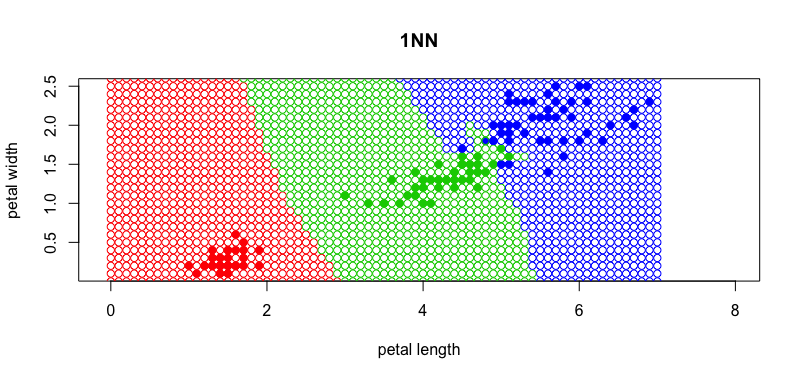
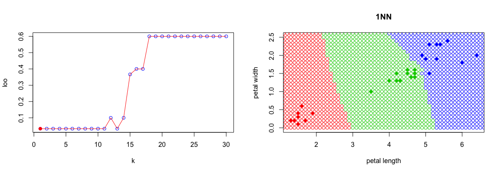
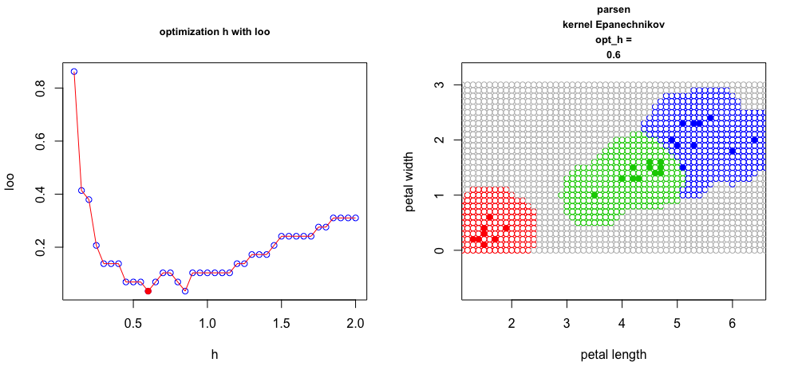

<h1>Метрические классификаторы</h1>

<h2>Постановка задачи:</h2>
<h3>Дано:</h3>
<ul>
	<li>X - объекты</li>
	<li>Y - ответы</li>
	<li> - обучающая выборка</li>
</ul>

<h3>Найти:</h3>
<ul>
	<li>Класс нового объекта х</li>
</ul>

<h2>Гипотеза компактности</h2>

близкие объекты, как правило, лежат в одном классе

<h2>Обобщенный метрический алгоритм классификации</h2>
Для произвольного  отранжируем объекты : 

  
,

<ul>где:
	<li></li>
	<li> - i-й сосед объекта х на </li>
	<li> - ответ на i-м соседе объекта х.</li>
</ul>

<h3>Метрический алгоритм классификации:</h3>

, 

<ul>
	<li> - оценка близости объекта x к классу y.</li>
	<li> - вес (степень важности) i-го соседа объекта x, неотрицателен и не возрастает по i.</li>
</ul>

<h2>1NN</h2>

 - метод 1NN

<h3>Плюсы:</h3>
<ul>
	<li>Простота реализации</li>
	<li>O(1) - время обучения</li>
</ul>

<h3>Минусы:</h3>
<ul>
	<li>Неустойчивость</li>
	<li>Требуется хранить всю выборку</li>
	<li>требуется много времени на вычисление класса нового объекта</li>
</ul>

<h2>KNN</h2>

 - метод KNN

<h3>Плюсы:</h3>
<ul>
	<li>Простота реализации</li>
	<li>O(1) - время обучения</li>
	<li>Устойчивость к выбросам</li>
</ul>

<h3>Минусы:</h3>
<ul>
	<li>Требуется хранить всю выборку</li>
	<li>требуется много времени на вычисление класса нового объекта</li>
</ul>

<h2>Выбор параметра k с помощью LOO</h2>

<h2>kWNN</h2>

 - метод k weight NN

<h3> Плюсы </h3>
<ul>
	<li>Учитывается степень близости объекта</li>
</ul>

<h3>Проверка качества</h3>
Для проверки качества полученного алгоритма я решил использовать метрику accuracy. Она показывают долю правильно классифицированных объектов. Тестовую выборку я сгенерировал случайным образом из наборов ирисов Фишера.

<h4>kNN(k=5): accuracy = 0.9666667</h4>
<h4>kWNN(k=1, q=0.05): accuracy = 1</h4>

<h2>kWNN на модельных данных</h2>

На рисунке ниже наглядно показано приемущество метода k взвешенных соседей.

<h2>Сравнение карт классификации</h2>

<h2>Parsen window</h2>
 , где h - ширина окна,  
K(r) - ядро, не возрастает и положительно на [0,1].

Метод парзеновского окна фиксированной ширины:
 

<h3>Rectangle kernel</h3>

<h4>opt_h = 0.6   loo(opt_h) = 0.03333333</h4>
<h4>Accuracy: 0.9666667</h4>

<h3>Gaussian kernel</h3>

<h4>opt_h = 0.1   loo(opt_h) = 0.03333333</h4>
<h4>Accuracy: 0.9666667</h4>

<h3>Epanechnikov kernel</h3>

<h4>opt_h = 0.6   loo(opt_h) = 0.03333333</h4>
<h4>Accuracy: 1</h4>

<h3>Quart kernel</h3>

<h4>opt_h = 0.6   loo(opt_h) = 0.03333333</h4>
<h4>Accuracy: 1</h4>

<h3>Triangle kernel</h3>

<h4>opt_h = 0.6   loo(opt_h) = 0.03333333</h4>
<h4>Accuracy: 1</h4>
