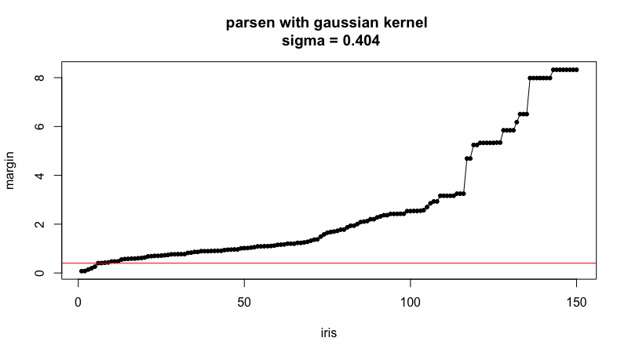

# STOLP

## Основные определения
**Отступ** - степень погруженности объекта в свой класс. Отступ будем обозначать: 
<div style="text-align: center">  </div>

Отступ вычисляется как: 
<div style="text-align: center"> , где: </div>

1.  - объект
2.  - обучающая выборка
3. 
4.  - вес i-го соседа объекта х

## Построение графика для объектов обучения относительно Парзеновского классификатора с Гауссовским ядром

```
margin <- function(x, my_iris, k) {
  l <- dim(my_iris)[1]
  n <- dim(my_iris)[2] - 1

  d <- c(0.0,0.0,0.0)
  names(d) <- c("setosa", "versicolor", "virginica")

  for (i in 1:l){
    curObjClass = my_iris[i, n+1]
    d[curObjClass] <- d[curObjClass] + kernelGaussian(my_iris[i,1:2], x[,1:2], metricFunction=euclideanDistance, h=0.1)
  }

  sortedCounts = sort(d)
  
  return(sortedCounts[3] - sortedCounts[2])
}
```



Time difference of 0.510514 secs

Time difference of 11.26882 secs

[1] "sigma = 0.404"
[1] "3  ||||  false positive =  100 / 150  =  0.667"
[1] "4  ||||  false positive =  100 / 150  =  0.667"
[1] "5  ||||  false positive =  50 / 150  =  0.333"
[1] "6  ||||  false positive =  7 / 150  =  0.047"
[1] "7  ||||  false positive =  4 / 150  =  0.027"
[1] "accuracy = 0.97"
Time difference of 0.593384 secs