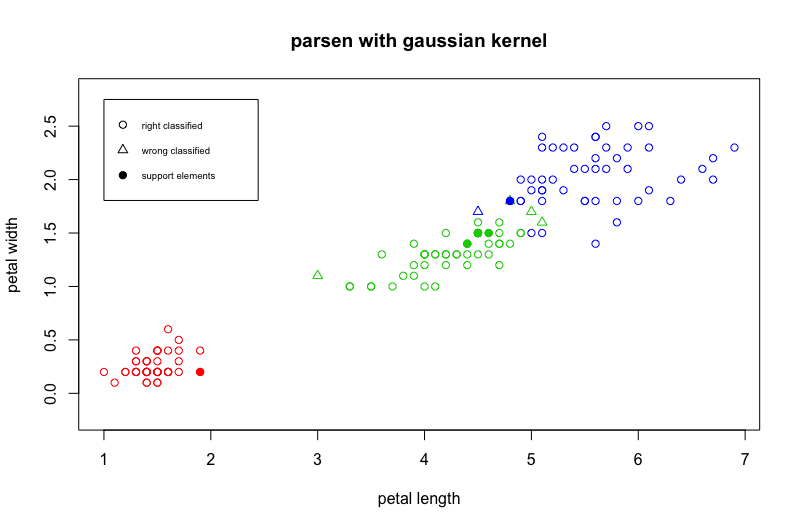

# STOLP

## Основные определения
**Отступ** - степень погруженности объекта в свой класс. Отступ будем обозначать: 
<div style="text-align: center">  </div>

Отступ вычисляется как: 
<div style="text-align: center"> , где: </div>

1.  - объект
2.  - обучающая выборка
3. 
4.  - вес i-го соседа объекта х

## Построение графика для объектов обучения относительно Парзеновского классификатора с Гауссовским ядром

```R
margin <- function(x, my_iris, k) {
  l <- dim(my_iris)[1]
  n <- dim(my_iris)[2] - 1
  
  d <- c(0.0,0.0,0.0)
  names(d) <- c("setosa", "versicolor", "virginica")
  
  for (i in 1:l){
    curObjClass = my_iris[i, n+1]
    d[curObjClass] <- d[curObjClass] + kernelGaussian(my_iris[i,1:2], x[,1:2], metricFunction=euclideanDistance, h=0.1)
  }
  
  namesD = names(d)
  
  dCur <- which(namesD %in% x$Species)
  
  sortedCounts = sort(d[-dCur])
  
  return(d[x[, 3]] - sortedCounts[2])
}
```


## STOLP описание алгоритма
### Вход:
1. Выборка ,
2. Допустимая доля ошибок ,
3. Порог отсечения выбросов ,
4. Алгоритм классификации ,
5. Формула для вычисления риска .

### Выход:
1. Множество эталонов .

### Описание работы алгоритма:
1. Создаем n множеств и добавляем в каждое из них объекты одного класса. Для каждого объекта считаем его отступ. Множеств обозначим .
2. Отбросить все выбросы, т.е. объекты у которых \delta" title="\color{Red}W >\delta" />
3. Сформировать . Из каждого класса выбираем объект с наименьшей величиной риска.
4. Наращиваем множество этолонов  до тех пор, пока число объектов выборки  классифицируемых неправльно не станет меньше, чем :
+  Выбираем класс, объекты которого чаще других распознаются неправильно. В этом классе выбираем объект с максимальной величиной риска и добавляем его во множество эталонов,
+ Удаляем этот из соответсвующего ему множества . 

### Рассмотрим пример работы алгоритмы для окна парзены с гауссовским ядром:
#### Параметры:

1. Выборка  - __Ирисы Фишера__,
2. Допустимая доля ошибок  = __5__,
3. Порог отсечения выбросов  - __отсечем 4% всех оюъектов__,
4. Алгоритм классификации  - __окно парзена с гауссовским окном(h=0.1)__,
5. Формула для вычисления риска 

[1] "3  ||||  false positive =  8 / 150  =  0.053"
[1] "4  ||||  false positive =  7 / 150  =  0.047"
[1] "5  ||||  false positive =  7 / 150  =  0.047"
[1] "6  ||||  false positive =  7 / 150  =  0.047"
[1] "7  ||||  false positive =  7 / 150  =  0.047"
[1] "8  ||||  false positive =  7 / 150  =  0.047"
[1] "9  ||||  false positive =  5 / 150  =  0.033"
[1] "10  ||||  false positive =  5 / 150  =  0.033"
[1] "11  ||||  false positive =  5 / 150  =  0.033"
[1] "12  ||||  false positive =  5 / 150  =  0.033"
[1] "13  ||||  false positive =  4 / 150  =  0.027"

| Шаг | Количество элементов  во множестве эталонов | Ошибка |
| --- | ------ |----------------|
| 1   | 3      | 8/150 = 0.053  |
| 2   | 4      | 7/150 = 0.047   |
| 3   | 5      | 7/150 = 0.047   |
| 4   | 6      | 7/150 = 0.047   |
| 5   | 7      | 7/150 = 0.047   |
| 6   | 8      | 7/150 = 0.047   |
| 7   | 9      | 5/150 = 0.033   |
| 8   | 10     | 5/150 = 0.033   |
| 9   | 11     | 5/150 = 0.033   |
| 10  | 12     | 5/150 = 0.033   |
| 11  | 13     | 4/150 = 0.027   |

### Шаг 1: __3 объекта__ во множестве эталонов, __точность 0.053__


### Шаг 2: __4 объекта__ во множестве эталонов, __точность 0.047__


### Шаг 3: __5 объектов__ во множестве эталонов, __точность 0.047__


### Шаг 4: __6 объектов__ во множестве эталонов, __точность 0.047__


### Шаг 5: __7 объектов__ во множестве эталонов, __точность 0.047__


### Шаг 6: __8 объектов__ во множестве эталонов, __точность 0.047__


### Шаг 7: __9 объектов__ во множестве эталонов, __точность 0.033__


### Шаг 8: __10 объектов__ во множестве эталонов, __точность 0.033__


### Шаг 9: __11 объектов__ во множестве эталонов, __точность 0.033__


### Шаг 10: __12 объектов__ во множестве эталонов, __точность 0.033__


### Шаг 11: __13 объектов__ во множестве эталонов, __точность 0.027__


## Сравнение скорости работы и точности

Для измерения скорости работы я использовал встроенную в R функцию __Sys.time()__. Для парзеновского окна без выбора эталоном она показала время работы 11.2 сек. После выбора эталонов был достигнут значительный прирост в скорости работы, а именно было получено значение 0.75 сек.

Для измерения качества работы я использовал метрику точности, т.е. долю правильных ответов. Как до применение алгоритма STOLP, так и после точность не изменилась и была равна 0.97, что является лучшим показателем для этих входных данных